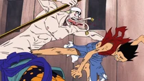
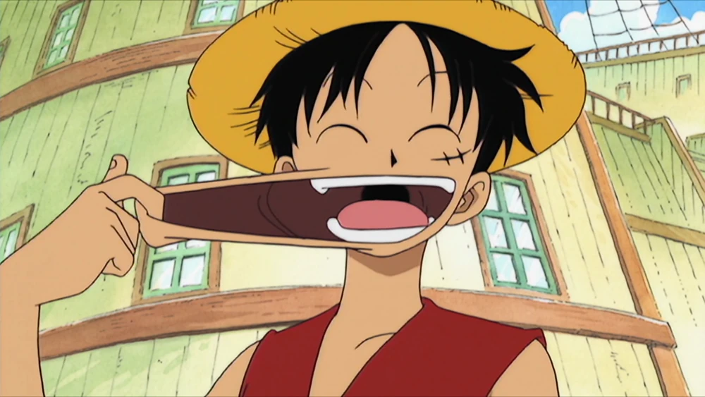
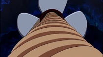

# гому гому но ми

[назад](Фрукты_ван_пис.md)

Гому Гому но Ми первоначально известный как Хито Хито но Ми, модель: Ника, представляет собой дьявольский плод типа Мифический зоан, который позволяет пользователю превращаться в легендарного «Бога Солнца» Ника и получить его способности, а именно тело со свойствами резины.Мировое Правительство переименовало его, чтобы стереть из истории первоначальное название плода,и в результате он был реклассифицирован как плод типа парамеция,который якобы превращает пользователя в Резинового Человека (ゴム人間 Гому Нингэн?).

Первоначально плод был сокровищем, которое Мировое правительство искало более 800 лет, пока не было украдено Шанксом и его командой.Двенадцать лет назад он был случайно съеден главным героем сериала Монки Д. Луффи.

Во второй версии Romance Dawn этот плод первоначально принадлежал деду Луффи.

Гому (ゴム?) означает "резина" на японском, заимствовано из голландского слова «gom» («gum»).
Хито (人?) по-японски означает «человек / человек (существо)»..
В дубляже от Comix-ART название плода перевели как "Плод Резина-Резина".

**Внешний вид**
Гому Гому но Ми – фиолетовый плод сферической формы с плодоножкой, расположенной в его верхней части. Рисунок состоит из завитков, напоминающих по своей форме букву "S". По внешнему виду плод больше всего похож на Мускусную Дыню.

В окончательном дизайне по всей поверхности расположены характерные для всех Дьявольских Плодов завитки, однако в первоначальном дизайне, показанном в первой версии Romance Dawn, они полностью отсутствуют.

**Сильные и слабые стороны**
Плод дает пользователю способность растягивать своё тело как резину, даже если тот не в состоянии сам её использовать (например, Нодзико вытянула голову Луффи из воды в Арлонг Парке, в то время как сам он ослаб, из-за воздействия морской воды). Вместе с тем, благодаря этой способности тело пользователя практически неуязвимо к атакам тупым оружием, ударам рукопашного боя, обычным пулям и даже пушечным ядрам, и вдобавок к этому способно выдерживать падения с огромной высоты и столкновения на высокой скорости с твёрдыми объектами, после которых нормальный человек получил бы серьёзные или смертельные повреждения. Также, из-за упругости, тело пользователя способно выдерживать огромное давление, поэтому Луффи не получил никаких повреждений, находясь на глубине десяти тысяч метров, хотя и был ослаблен океанской водой. Благодаря тому, что способность растяжения и сжатия имеет множество применений как в сражении, так и вне боя, этот Дьявольский плод является одним из самых разносторонних и непредсказуемых, среди Парамеций.

Luffy Kicks Enel

Луффи пинает Энеля без использования Хаки
Способность растягивать конечности на значительные расстояния, при этом закручивая их, позволяет пользователю существенно увеличить мощность и радиус своих техник, и атаковать со средней или длинной дистанции. Вдобавок, если растянуть или сжать конечность прежде чем атаковать, чтобы увеличить потенциальную энергию удара, то можно дополнительно повысить его скорость, что приведёт к ещё большему возрастанию мощности техники. В сочетании с Хаки Вооружения сила атак увеличивается ещё больше. Благодаря изоляционным свойствам резины, пользователь плода имеет невосприимчивость к любым атакам основанным на электричестве (в том числе и Электро) и даже способен наносить урон пользователям Горо Горо но Ми без использования Хаки Вооружения.

В первом SBS, Ода заявил, что максимальное расстояние растяжения тела Луффи составляет 72 Gomu Gomus.

Во время тренировок, Луффи обнаружил несколько неординарных способов повышения боеспособности. Расширяя и сужая кровеносные сосуды он увеличивает скорость своего кровообращения, благодаря чему становится значительно сильнее и быстрее, но при этом быстро расходуя энергию тела. Вдобавок, при комбинировании этой техники с Хаки Вооружения он способен воспламенять свои конечности, отчего его атаки становятся ещё более разрушительными.Также Луффи может надувать свои кости, увеличивая тем самым на некоторое время объём какой-либо части тела, что значительно повышает силу его атак. Однако после использования этой техники размер всего тела Луффи уменьшается, отчего он становится похожим на ребёнка.Судя по всему, после Таймскипа Луффи избавился от этого побочного эффекта.

Также способность растягивать свои конечности можно использовать для повышения мобильности, чтобы быстро перемещаться по полю боя: схватившись за что-либо растянутыми руками можно «притянуться» к этому объекту или совершить прыжок на большое расстояние, запустив себя в воздух словно снаряд из рогатки,благодаря чему можно нападать сверху или уклонятся от атак.Чтобы ещё увеличить свою мобильность, Луффи во время двухлетнего перерыва разработал технику похожую на Геппо, с помощью которой способен свободно передвигаться по воздуху.

Дьявольский плод влияет на все части тела пользователя, среди которых и внутренние органы, поэтому желудок также растягивается. По этой причине у Луффи повышенный аппетит по сравнению с обычным человеком, вследствие чего он может съесть намного больше чем любой другой член его команды. Это можно использовать не только, чтобы быстро восстановиться после сражений,но и прямо в бою, как, например, в битве с Крекером, когда Луффи съедал бисквит, который тот создавал.

Несмотря на все преимущества, приобретаемые пользователем этого дьявольского плода, он всё равно может получить ранения от колющего и режущего оружия, а также от нефизических атак, таких как огонь или лёд. Одной из основных слабостей Луффи является то, что он уязвим для атак в те моменты, когда его конечности растянуты до предела. Впервые её заметил Багги,а Куро даже смог воспользоваться ей.Чтобы нивелировать этот недостаток Луффи адаптируется под боевой стиль соперников,однако ему это не всегда удаётся: в сражении с Крекером, выскочил из разрушенного Бисквитного Солдата и порезал руку Луффи.

Inexperiencedgomugomu
Маленький Луффи тренируется использовать силы своего плода.

В детстве, сразу после того как Луффи получил силу плода Гому Гому но Ми у него были проблемы с контролем даваемых им способностей. Хотя он и представлял то, как они должны были работать, Луффи не мог нормально прицелиться и выбрать нужное время для нанесения удара, вследствие чего постоянно попадал по себе.Тем не менее, ему удалось успешно решить свои проблемы и овладеть силой плода, благодаря длительным тренировкам в джунглях.

В аниме Луффи использовал свои способности к растяжению, чтобы вдохнуть большое количество воздуха и, выдыхая, создать сильный порыв ветра; он применял этот приём для того, чтобы сдуть пары ядовитых плевков Мэриголд,а также ядовитый туман Магеллана, который он создал с помощью техники Doku Gumo.

Кроме того, как и все пользователи дьявольских плодов, Луффи плавает как топор и слабеет от морской водыи Кайросэки.Однако, он иногда забывает об этой слабости, и не задумываясь ныряет в океан, чтобы опробовать какой-нибудь вид водного спорта или спасти тонущего человека. При контакте с водой и Кайросеки Луффи теряет лишь свои собственные силы и способность поглощать удары тупым оружием (как в случае с Дзюттэ Смокера), однако его тело по-прежнему сохраняет свойства резины, что позволяет другим людям растягивать его.

Также пользователи Гому Гому но Ми подвержены атакам с использованием Хаки Вооружения, однако тело всё равно сохраняет способность растягиваться.Благодаря его использованию, удары кулаком дедушки Луффи причиняли ему боль, чему всегда удивлялся юный пират (хотя Гарп всегда говорил, что это из-за «силы любви»).

**Использование**

Луффи использует способности плода Гому Гому но Ми множеством разных способов: от простого перемещёния с одного места на другое в довольно безрассудной манере, до нападения на противника шквалом быстрых и сильных ударов. Через некоторое время Луффи разработал несколько специфических боевых техник, таких как Второй или Третий Гир, которые позволяют ему мгновенно увеличить свою силу в бою. Во время Таймскипа, он научился использовать Хаки в сочетании с силой дьявольского плода, а также значительно лучше контролировать свои боевые формы, избавившись при этом от их побочных эффектов. Вдобавок к этому он разработал новую технику — Четвёртый Гир, превосходящую по силе предыдущие.

Луффи очень весёлый и безрассудный, поэтому он использует свои способности не только во время боя. Когда Луффи развлекается со своей командой или с кем-то другим, он использует эластичные свойства своего тела для различных шуток, таких как создание смешных рожиц, или игр, придуманных им самим или совместно с другими членами команды. Во время дружеских застолий и вечеринок он имеет дурную привычку «стягивать» у других еду, растягивая свои руки. Также он использует способности дьявольского плода для транспортировки других людей или самого себя на большие расстояния, а также для спасения своих накама из опасных ситуаций, таких как падение с высоты или в океан. Ему также безразлично, если другие люди играют с его резиновым телом, растягивая кожу.

**Прочее**

Это первый Дьявольский плод, а также первый плод типа Парамеция, который был показан в манге и аниме. Также это первый Дьявольский плод, который показан в виде плода ещё до его съедания (другими являются Бара Бара но Ми, Ава Ава но Ми, Уси Уси но Ми, модель: Жираф, Ями Ями но Ми, Мэра Мэра но Ми, Опэ Опэ но Ми, Ито Ито но Ми и не канонический Бато Бато но Ми, модель: Вампир).
В 3-ем фильме было показано, что Луффи не утонет в воде, если он использует свою технику Gomu Gomu no Fusen. Это было показано и в аниме.
Первая демонстрация способностей Луффи в манге и причина, по которой он его съел, отличается показанной в аниме. В манге, Шанкс схватил руку Луффи, когда тот пытался уйти, вследствие чего его рука растянулась, а плод он съел, так как думал, что это десерт. В аниме, Шанкс был свидетелем того, как Луффи съел плод Гому Гому, и, разозлившись, попытался заставить его выплюнуть, схватив мальчика за ноги и тряся его вверх и вниз, в результате чего обе ноги Луффи растянулись так, что он ударился лицом об пол. Однако в шестом спецвыпуске Эпизод Луффи, была показана версия этого события из манги.
В арсенале Луффи гораздо больше техник с использованием способностей дьявольского плода чем у любых других персонажей в манге и аниме.
После Таймскипа, Луффи может активировать Второй Гир, не вставая в обычную стойку. Теперь, он может ускорять кровоток, даже находясь при этом в воздухе, а также выбирать определённую часть тела, в которой это нужно сделать, подобно пользователям дьявольских плодов типа Зоан, которые могут частично трансформировать в животную форму отдельные части тела.
После Таймскипа, Луффи больше не возвращается в свою мини-форму после применения Третьего Гира. Это было подтверждено в SBS 68-го тома.
В одном из SBS фанат спросил Оду: Может ли половой орган Луффи растягиваться? На что Ода ответил: Может.